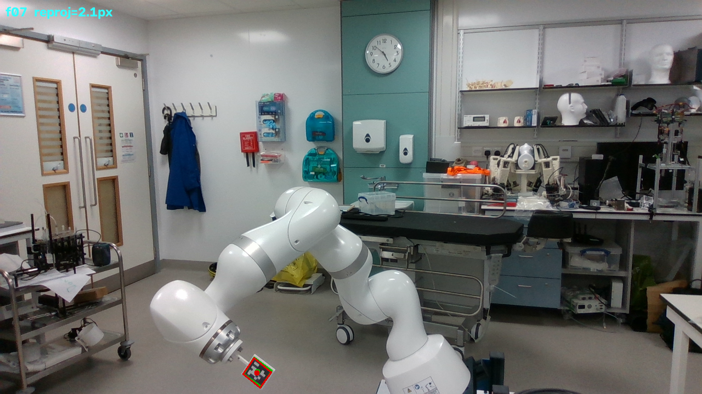
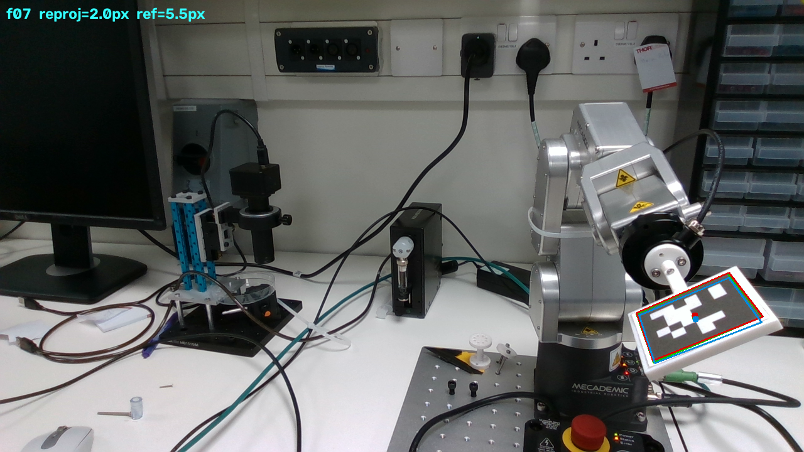
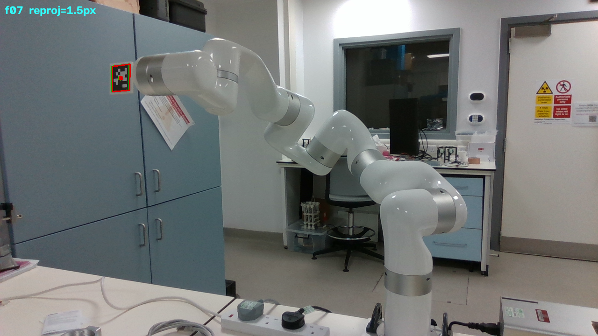

# hydra-data-calibration

Bootstrap ground-truth camera poses for the Hydra ICP benchmark and assemble
them into an evaluation dataset for robot pose estimation.

The raw benchmark data (three robots, three camera placements each, 15 joint
configurations per placement) ships without ground-truth camera poses. This
repo reproduces the marker-based multi-frame PnP calibration from the Hydra
paper (Section III-A.1) to recover one `T_cam_base` per (robot, measurement),
validates it against the paper's published numbers, and assembles images,
intrinsics, joint states, and the bootstrapped GT into a flat `hydra_eval/`
layout.

## Credit and data provenance

The dataset was created by the authors of

> **Hydra: Marker-Free RGB-D Hand-Eye Calibration.**
> Martin Huber, Huanyu Tian, Christopher E. Mower, Lucas-Raphael Mueller,
> Sebastien Ourselin, Christos Bergeles, Tom Vercauteren. 2025.
> [arXiv:2504.20584](https://arxiv.org/abs/2504.20584)

Their code and ROS 2 integration:
[lbr-stack](https://github.com/lbr-stack) / see the paper for links.

The paper states the benchmark would be open-sourced under Apache 2.0; that
release has not happened yet. The data is redistributed here with the
permission of Martin Huber (martin.huber@kcl.ac.uk) for research purposes,
and **all rights to the data remain with the Hydra authors**. See
[DATA_NOTICE.md](DATA_NOTICE.md). The code in this repo is MIT-licensed.

If you use the data, cite the Hydra paper:

```bibtex
@misc{huber2025hydramarkerfreergbdhandeye,
      title={Hydra: Marker-Free RGB-D Hand-Eye Calibration}, 
      author={Martin Huber and Huanyu Tian and Christopher E. Mower and Lucas-Raphael Müller and Sébastien Ourselin and Christos Bergeles and Tom Vercauteren},
      year={2025},
      eprint={2504.20584},
      archivePrefix={arXiv},
      primaryClass={cs.RO},
      url={https://arxiv.org/abs/2504.20584}, 
}
```

## Setup

Needs Python 3.11 or newer; the published ground truth was produced on 3.14.

```bash
pip install -r requirements.txt
python download_data.py          # 658 MB zip from Google Drive, SHA-256 verified
```

The download script unpacks the data to `24_12_19_hydra_icp_eval/` in the
repo root. It is safe to re-run (skips if present; `--force` re-downloads).

## Pipeline

Two commands, run in this order:

```bash
python calibrate.py --dataset 24_12_19_hydra_icp_eval
python build_dataset.py --dataset 24_12_19_hydra_icp_eval --out hydra_eval
```

`calibrate.py` is the heart of the repo: it reproduces the Hydra paper's
marker-based PnP calibration (Section III-A.1) to recover the ground truth
that the raw data does not ship. It solves one `T_cam_base` per
(robot, measurement) via a single global `cv2.solvePnP` (SQPnP) over the
AprilTag corners of all detected frames, prints the evaluation tables below,
and writes `T_cam_base_pnp.npy` into the raw dataset tree (under each
`realsense_april/`). `build_dataset.py` then assembles the dataset; if a
`T_cam_base_pnp.npy` is missing it re-runs the calibration on the fly.

Optional qualitative check (GREEN detected corners, RED calibrated
reprojection, BLUE the reference GT where it exists):

```bash
python visualize_reprojection.py --dataset 24_12_19_hydra_icp_eval --robot meca --measurement 0
```

Example output, one frame per robot (measurement 0, full RealSense frame; the
AprilTag is small in view). GREEN detected corners, RED reprojection through
the calibrated `T_cam_base`, BLUE the reference GT (meca/measurement_0 only).
The per-frame reprojection error is printed top-left.

| lbr | meca | xarm |
|:---:|:---:|:---:|
|  |  |  |

## Output layout

```
hydra_eval/
|-- lbr/
|   |-- measurement_0/
|   |   |-- T_cam_base.npy      (4,4) float64  GT camera pose
|   |   |-- camera_K.npy        (3,3) float64  RealSense intrinsics
|   |   |-- images/             000.png ... 014.png  (1280x720 RGB)
|   |   `-- ground_truth.json   {frame_idx: {"joints": [...]}}  (radians)
|   |-- measurement_1/
|   `-- measurement_2/
|-- meca/
`-- xarm/
```

## Units and conventions

- `T_cam_base`: `p_cam = T_cam_base @ p_base`, float64 4x4 (the direct
  output convention of `cv2.solvePnP`). Invert for the camera pose in the
  base frame.
- `camera_K.npy`: 3x3, pixel units. Distortion is zero for all
  measurements (confirmed from the dataset YAMLs).
- Joints: radians; 7 values for lbr/xarm, 6 for meca.
- AprilTag: 5 x 5 cm outer boundary. `TAG_FAMILY = tag36h11` is an
  assumption: the paper cites the apriltag library but never names the
  family; tag36h11 is its default and detects all 135 frames.
- Corner ordering (pyapriltags): bottom-left, bottom-right, top-right,
  top-left.
- Raw-data conventions: `base2ee = T_{EE<-base}` (FK output),
  `tag2ee = T_{EE<-tag}` (CAD). Tag corners in the base frame use
  `T_tag2base = inv(base2ee) @ tag2ee`. Of the four possible formula
  variants this is the only one with near-zero multi-frame cluster spread,
  and it matches the reference `base2cam_calib.npy` in meca/measurement_0.


## LBR tag frame

The LBR's released `tag2ee_cad.npy` is rotated 180 degrees about the tag
x-axis relative to the corner order the detector reports. Used as-is it pairs
each predicted corner with the opposite detected one (37-59 px corner residual
versus ~1 px for the meca) and misses Hydra Table I; `calibrate.py`
right-multiplies it by Rx(180) (`TAG2EE_CORRECTION`), which brings the residual
to 1.4-2.0 px and reproduces the paper. This is the pipeline's one departure
from the released tag transforms.

## Known data quirks

- The raw dataset also contains `zed_april/` and `zed_hydra/` folders (ZED
  stereo camera); this pipeline only reads `realsense_*`.
- Only meca/measurement_0 has a reference `base2cam_calib.npy`; it is used
  for validation only.
- `calibrate.py` writes its results into the raw dataset tree
  (`realsense_april/T_cam_base_pnp.npy`), by design.

## Reproduction

`calibrate.py` prints these tables; numbers below are from a fresh run of
this repo (Monte Carlo cross-validation, N=9 train / 6 held-out, 5 splits,
pooled across the 3 measurements per robot, directly comparable to Hydra
Table I, PnP + RealSense column).

| Robot | Ours (px)     | Ours (mm)     | Paper (px)  | Paper (mm)  |
|-------|---------------|---------------|-------------|-------------|
| lbr   | 1.25 +/- 0.28 | 1.50 +/- 0.48 | 1.5 +/- 0.7 | 1.8 +/- 0.9 |
| meca  | 0.83 +/- 0.24 | 0.55 +/- 0.15 | 1.0 +/- 0.6 | 0.6 +/- 0.3 |
| xarm  | 4.30 +/- 1.06 | 3.15 +/- 0.97 | 4.6 +/- 1.9 | 3.9 +/- 2.0 |

All three robots match the paper (the LBR only after the tag-frame
correction described above). The px-to-mm conversion follows the paper's
AprilTag-centric scale (Section III-A.2: errors are "rescaled according to
the AprilTag boundaries" and scaled "by the AprilTag size"), i.e. the
physical tag size over the detected tag side length, per frame.

Repeatability vs. training size (centre reprojection, px, cf. Hydra Fig. 5):

| Robot | N=3               | N=6              | N=9           | N=12          |
|-------|-------------------|------------------|---------------|---------------|
| lbr   | 4.98 +/- 3.26     | 1.68 +/- 0.95    | 1.25 +/- 0.28 | 1.15 +/- 0.35 |
| meca  | 1.53 +/- 0.77     | 1.02 +/- 0.26    | 0.83 +/- 0.24 | 0.79 +/- 0.36 |
| xarm  | 10.63 +/- 4.61    | 4.83 +/- 1.18    | 4.30 +/- 1.06 | 4.09 +/- 1.38 |

Final GT over all frames (what gets saved to `T_cam_base_pnp.npy`):

| Robot | Meas | Frames | Corner (px) | Centre (px) | Centre (mm) | Cam dist (m) |
|-------|------|--------|-------------|-------------|-------------|--------------|
| lbr   | 0    | 15     | 1.37        | 0.92        | 1.29        | 1.689        |
| lbr   | 1    | 15     | 1.57        | 0.93        | 1.17        | 1.573        |
| lbr   | 2    | 13     | 2.01        | 1.02        | 0.90        | 1.239        |
| meca  | 0    | 15     | 1.46        | 0.70        | 0.48        | 0.706        |
| meca  | 1    | 15     | 0.83        | 0.51        | 0.34        | 0.909        |
| meca  | 2    | 15     | 1.06        | 0.71        | 0.47        | 0.885        |
| xarm  | 0    | 14     | 3.63        | 3.47        | 2.64        | 0.988        |
| xarm  | 1    | 15     | 3.76        | 3.68        | 3.10        | 1.128        |
| xarm  | 2    | 15     | 2.46        | 2.35        | 1.69        | 1.005        |
